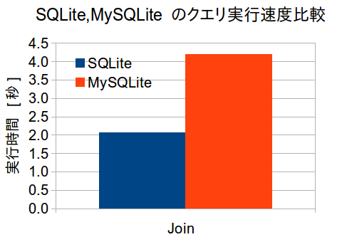

# MySQLite: SQLiteデータベースを読み書きするMySQLストレージエンジン

2014/02/18

第2回 MariaDB/MySQL コミュニティイベント

中谷 翔

---

## 自己紹介

- 中谷 翔 [@laysakura](https://twitter.com/laysakura)
- 東京大学 情報理工学系研究科 修了(予定)
  - 分散ストリーム処理系
- IPA未踏: **High Performance SQLite の開発**
  - 得た知見からMySQLiteの開発に着手
- 4月からDeNA入社

---

## 発表アウトライン

1. **開発背景**
1. デモ
1. 仕組み
1. 現状
1. 評価
1. まとめ

---

## SQLiteのクエリ実行は低速


---

## 高速なMySQL/MariaDBのクエリ実行系を利用


SQLiteのDBファイルを扱うMySQL/MariaDBストレージエンジンエンジンを開発

---

## なぜSQLiteクエリ実行は遅いのか


- [VDBE (Virtual Database Engine)](http://www.sqlite.org/vdbe.html)の機構が大きな原因
  - SQLはVDBE命令列に変換されて実行される
  - VDBE命令間をまたいだ操作のためにメモリ操作が頻発
  - VDBEは改変が困難
    - レジスタマシンに近い低級なモデル
    - 1つのVDBE命令が複数の種類のSQLで共通利用される

---

## MySQLiteの開発経緯

- 「SQLiteを改善する」未踏ではクエリ実行系の抜本的な改善に踏み切れなかった
- 未踏ではSQLiteのページャ部分を高速化
  - フルスキャンの合成ベンチマークで最大5.0倍の高速化
- クエリ実行系は外部のものを利用するアプローチを構想し、DeNAインターン(と趣味)でMySQLiteを実装
  - **ソートやGroup-byクエリで高速化を実現**

---

## 発表アウトライン

1. 開発背景
1. **デモ**
1. 仕組み
1. 現状
1. 評価
1. まとめ

---

## SQLite DBファイル作成

```sql
$ sqlite3 /home/nakatani/foobar.sqlite

sqlite> .schema
CREATE TABLE T0 (col0 INT);
sqlite> select * from T0;
777
333
111
888
```

---

## MySQLite を使ってSQLite DBを読む

```sql
$ mysql

mysql> use test
mysql> show tables;
+----------------+
| Tables_in_test |
+----------------+
| ...            |
+----------------+
mysql> create table T0 engine=mysqlite file_name='/home/nakatani/foobar.sqlite,T0';
mysql> show tables;
+----------------+
| Tables_in_test |
+----------------+
| ...            |
| T0             |
+----------------+
mysql> select * from T0;
+------+
| col0 |
+------+
|  777 |
|  333 |
|  111 |
|  888 |
+------+
```

---

## 発表アウトライン

1. 開発背景
1. デモ
1. **仕組み**
1. 現状
1. 評価
1. まとめ

---

## MySQLiteの役割 (再掲)


SQLiteのDBファイルを読み書きし、クエリ実行はMySQL/MariaDBに任せる

---

## 動作の流れ

1. `create table T engine=mysqlite file_name='a.sqlite,T'`
   - ストレージエンジンが `a.sqlite` ファイルをオープン
1. `select * from T`
   - ストレージエンジン中の1行読出す関数 (`next`) でSQLite DBファイルから `T` のレコードを順々に読む
   - 読んだレコードは保持されず、**データの実体は常にSQLite DB**

---

## SQLite DBファイルのパーズ

- SQLite DBファイルの構成が解析できている必要がある
- [公式ページに詳しいドキュメント](http://www.sqlite.org/fileformat2.html) がある
- 未踏期間に [SQLiteDbVisualizer](https://github.com/laysakura/SQLiteDbVisualizer) を作って慣れた


---

## SQLite DBファイルの排他制御


- SQLite DBファイルのアクセス競合が、`mysql`クライアント同士とも`sqlite3`プロセスとも起こり得る
- `fcntl(2)` によるファイルロックで reader-writer ロック
  - SQLiteも `fcntl(2)` を使用している

---

## MariaDBに助けられた話(1)

- SQLiteのスキーマ情報は、MySQL/MariaDB側にもコピーしなければならない
- SQLiteから`CREATE TABLE`や`CREATE INDEX`のようなDDLは得られる
- **ストレージエンジンの中で** DDLから実際にスキーマを作成するには?
  - ストレージエンジンの中では普通はSQLは実行できない

---

## MariaDBに助けられた話(2)

- MariaDBには`init_from_sql_statement_string()`という謎APIが
  - **MySQLにはない**
  - ストレージエンジンの中からDDLを実行してスキーマ作成するための(変態)API
- MariaDBは開発者にも優しい(!?)

---

## 発表アウトライン

1. 開発背景
1. デモ
1. 仕組み
1. **現状**
1. 評価
1. まとめ

---

## 現状の開発状況

- フルスキャンクエリのみ
- インデックススキャン, 書込トランザクションは未実装
  - インデックススキャンは、SQLite DBファイルのインデックス構造が分かっているので比較的容易に対応できる
  - 書込トランザクションも前述の排他制御を含め、一部実装中(ただしデバッグに苦戦しそう)

---

## 発表アウトライン

1. 開発背景
1. デモ
1. 仕組み
1. 現状
1. **評価**
1. まとめ

---

## 評価環境

| ソフトウェア |           バージョン |
|--------------|----------------------|
| SQLite       |               3.7.16 |
| MariaDB      |               10.0.2 |
| OS           | Linux 2.6.32-5-amd64 |

　

| ハードウェア | スペック                    |
|--------------|-----------------------------|
| CPU          | Intel Xeon E5530 @ 2.40 GHz |
| メモリ       | 24GB                        |

- SQLite DBファイルはファイルキャッシュに乗っている

---

## SQLiteとの速度比較1 - 設定

```sql
-- T: (key_col INT, val_col INT), 10,000,000 行

-- Sort
select * from T order by val_col limit 5;

-- Group-by
select avg(val_col) from T group by key_col;  -- key_colは5種類

-- Scan-only
select count(*) from T;
```

---

## SQLiteとの速度比較1 - 結果


- 単純なスキャンは遅く、それ以外は速い
  - スキャンが遅いのはストレージエンジン実装最適化不足 :P

---

## SQLiteとの速度比較2 - 設定

```sql
-- T: (key_col INT, val_col INT), 250,000 行
-- S: (key_col INT, val_col INT),     100 行

-- Join
select count(*) from T, S where T.key_col = S.key_col;

```

---

## SQLiteとの速度比較2 - 結果



- Joinで負けているが、内部表T(250,000行)のスキャンを外部表S(100行)の行数分行ったからと予想
  - 250,000行のスキャン => 0.0343秒(Scan-only結果から計算)
- **スキャン実装を速くすれば勝てる**(おそらく)

---

## 発表アウトライン

1. 開発背景
1. デモ
1. 仕組み
1. 現状
1. 評価
1. **まとめ**

---

## まとめ

- SQLiteの低速なクエリ実行の代わりにMySQL/MariaDBを利用するためにMySQLiteを開発
- Sortで15.3倍, Group-byで9.0倍の高速化
- Scan-onlyでは0.1倍(遅い)。これはストレージエンジン実装の問題
- Joinでは0.5倍(遅い)。Scan-onlyが遅いのと同様の理由と予想

---

## 今後の展望

- フルスキャン実装の高速化
- インデックス対応
- 書き込みトランザクション対応
- MySQL/MariaDBの高速な並列トランザクションを利用して、SQLiteでは到達できない境地に達したい
- Connect strage engineにSQLiteサポート追加?

---

Thank you for listening!
